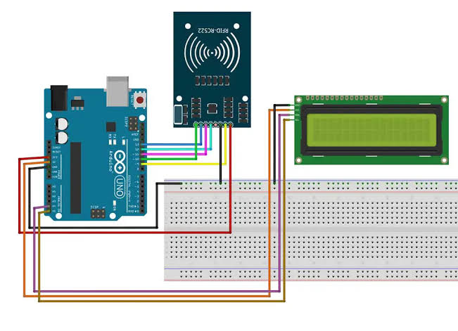

 project: RFID Based Attendance System

 Project Overview :
This project is an RFID-based attendance system developed using Arduino and RC522 RFID module. The system reads the unique ID of RFID cards and marks attendance automatically. The card ID is displayed on a 16x2 LCD display.

 Components Used :
- Arduino Uno
- RFID RC522 Module
- 16x2 LCD Display
- Breadboard
- Jumper Wires

 Technologies Used :
- Embedded C
- Arduino IDE
- SPI Communication

 Working Principle :
The RFID reader reads the UID from the RFID card using SPI communication. The Arduino processes the UID and displays the card number on the LCD display. Attendance is recorded automatically when a valid card is scanned.

 Applications :
- School and College Attendance System
- Office Attendance System
- Employee Entry Monitoring System

## Circuit Diagram

